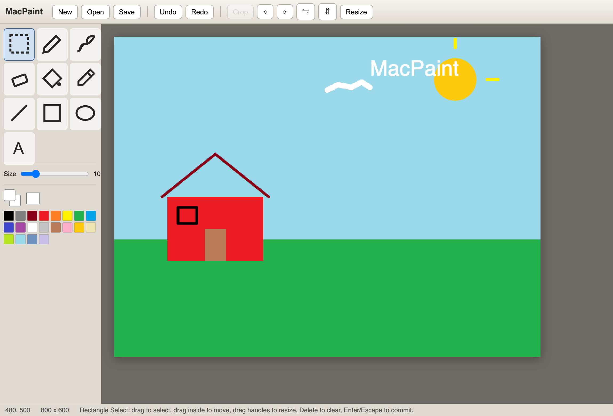

# MacPaint

A dependency-free, MS Paint–style image editor for the browser. Plain HTML, CSS, and JavaScript — no build step, no install, no framework. Open `index.html` and start drawing or editing a photo.



## Features

**Drawing tools**
- Pencil, brush, eraser
- Fill bucket, eyedropper (color picker)
- Line, rectangle, ellipse (outline, filled, or both)
- Text tool
- Adjustable brush/tool size
- Primary/secondary color swatches with a 20-color palette, plus a native color picker

**Selection**
- Rectangle select with move (leaves a background-colored hole, classic MS Paint behavior)
- Corner and edge handle resizing
- Copy / cut / paste, arrow-key nudging, delete

**Image editing**
- Open any image file — via the Open button, drag-and-drop onto the canvas, or pasting from the system clipboard
- Crop to selection
- Rotate 90° clockwise/counter-clockwise
- Flip horizontal/vertical
- Resize (scale) the whole image, with an optional aspect-ratio lock
- New canvas at a custom size
- Save the canvas out as a PNG

**Editing**
- Undo/redo (up to 40 steps)

## Usage

No build, no server, no dependencies. Just open the file:

```bash
open index.html
```

or double-click `index.html` in Finder.

## Keyboard shortcuts

| Key | Action |
| --- | --- |
| `S` | Select |
| `P` | Pencil |
| `B` | Brush |
| `E` | Eraser |
| `F` | Fill bucket |
| `K` | Eyedropper |
| `L` | Line |
| `R` | Rectangle |
| `O` | Ellipse |
| `T` | Text |
| `Cmd+Z` | Undo |
| `Shift+Cmd+Z` | Redo |
| `Cmd+A` | Select all |
| `Cmd+C` / `Cmd+X` / `Cmd+V` | Copy / cut / paste selection |
| `Cmd+V` (with an image on the clipboard) | Paste an image from outside the app |
| Arrow keys | Nudge active selection |
| `Delete` | Clear selection contents |
| `Enter` / `Escape` | Commit active selection |

Left-click draws with the primary color; right-click draws with the secondary color.

## Project structure

```
index.html   Markup, toolbar, dialogs
style.css    All styling
app.js       All application logic (single IIFE, no globals leaked)
```

Everything is vanilla — no bundler, no package manager, no transpilation. Clone the repo and open `index.html`; that's the whole setup.

## License

MIT — see [LICENSE](LICENSE).
